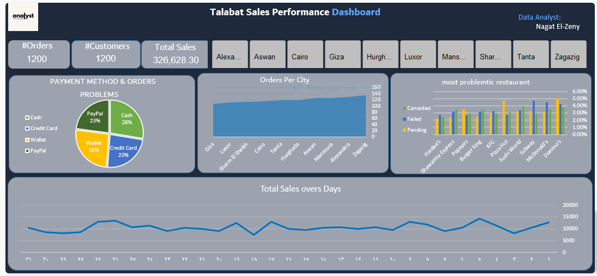

# Talabat Sales Performance Dashboard

## 📌 Project Overview
The **Talabat Sales Performance Dashboard** is a visual analytics project designed to monitor and evaluate sales performance across different Egyptian cities.  
It provides insights into order volumes, customer distribution, payment method trends, and operational issues in partner restaurants.

---

## 📊 Key Metrics
- **#Orders:** 1,200  
- **#Customers:** 1,200  
- **Total Sales:** 326,628.30  

---

## 🧩 Dashboard Features

### 1. Payment Method & Order Problems
- Cash: 28%  
- Credit Card: 23%  
- Wallet: 26%  
- PayPal: 23%  
- Helps analyze which payment methods face the most transaction issues or customer complaints.

### 2. Orders Per City
- Compares the number of orders in major cities such as **Cairo, Giza, Alexandria, Luxor, Aswan, Hurghada, Tanta,** and **Zagazig.**
- Useful for identifying top-performing regions and potential markets for improvement.

### 3. Most Problematic Restaurants
- Tracks **Cancelled**, **Failed**, and **Pending** orders per restaurant.
- Examples include: **KFC**, **Domino’s**, **Pizza Hut**, **McDonald’s**, etc.
- Supports quality control and partnership performance review.

### 4. Total Sales Over Days
- Line graph showing sales fluctuations over time.
- Assists in detecting trends, seasonality, or promotional effects.

---

## ⚙️ Tools & Technologies
- **Microsoft Excel / Power BI / Tableau** *(depending on the version used)*  
- **Data Cleaning & Transformation:** Excel Power Query / Python (optional)  
- **Data Visualization:** Power BI dashboards and DAX calculations  
- **Design Elements:** Consistent color palette and grid-based layout for clarity

---

## 🚀 Insights
- Wallet and PayPal are among the most frequently used payment methods.  
- Cairo and Giza lead in total orders, while Luxor and Aswan have smaller volumes.  
- Restaurant performance monitoring reveals cancellation and delay trends affecting customer satisfaction.  
- Daily sales trends indicate fluctuations that may correlate with weekends or marketing campaigns.

---

## 👩‍💻 Author
**Data Analyst:** *Nagat El-Zeny*  
For inquiries or collaboration: [LinkedIn](https://www.linkedin.com/in/nagat-elzeny-651584357/) | [Email](Nagatelzeny79@gmail.com)

---

## 📁 Repository Structure
